# Welcome to your CDK TypeScript project

This is a blank project for CDK development with TypeScript.

The `cdk.json` file tells the CDK Toolkit how to execute your app.

## Useful commands

* `npm run build`   compile typescript to js
* `npm run watch`   watch for changes and compile
* `npm run test`    perform the jest unit tests
* `npx cdk deploy`  deploy this stack to your default AWS account/region
* `npx cdk diff`    compare deployed stack with current state
* `npx cdk synth`   emits the synthesized CloudFormation template

## GitHub Token Setup for CI/CD

This section describes the steps required to configure GitHub authentication for the CDK CI/CD pipeline.

### Steps to Set Up GitHub Token

1. **Create a GitHub Token**
   - Go to GitHub and navigate to your account settings
   - Create a personal access token with the necessary permissions
   - The token requires the following permissions:
     - `repo` - to read the repository
     - `admin:repo_hook` - if you plan to use webhooks (enabled by default)

2. **Add the Token to AWS Secrets Manager**
   - Store the GitHub token in AWS Secrets Manager
   - Create a secret named `github-token` (unless specified otherwise)
   - This secret will be used by the CDK pipeline for authentication

### Important Notes

- Authentication for the CodePipeline source will be performed automatically using the `github-token` secret stored in AWS Secrets Manager
- If you rotate the value in the Secret, you must also change at least one property on the Pipeline to force CloudFormation to re-read the secret

## Troubleshooting

### npm ci fails with "Missing: jsonschema@1.4.1 from lock file"

This is a known issue with aws-cdk-lib@2.254.0 and npm 11. The problem occurs due to conflicting bundled dependency versions:

- aws-cdk-lib bundles `jsonschema@1.5.0` at the top level
- But also bundles `@aws-cdk/cloud-assembly-api@2.2.3` which requires `jsonschema@~1.4.1`
- The version constraint `~1.4.1` excludes version `1.5.0`, creating an unsatisfiable dependency conflict
- npm 11's stricter bundled dependency validation detects this mismatch in the lock file

**Solution:**

Run the following command to regenerate the package lock file:

```bash
npm install --package-lock-only
```

Then proceed with:

```bash
npm ci
npm run build
npm test
```

For more details, see the [AWS CDK GitHub issue #37870](https://github.com/aws/aws-cdk/issues/37870).

## esbuild Requirement for cdk synth

Install `esbuild` in the project so CDK can bundle Lambda assets locally during synthesis:

```bash
npm i esbuild
```

If `esbuild` is not installed, `cdk synth` falls back to Docker to execute the bundling step.

## CDK Workflow: Before and After CI/CD Pipeline

### Until now with CDK

- Define our stacks
- Add them inside the `bin` file (the one with `app`)
- Run `cdk synth`
- Run `cdk deploy`

### With CodePipeline

- Define one Pipeline stack inside the `bin` file (the one with `app`)
- The pipeline contains stages (construct: `Stage`)
- The stages hold other stacks
- The pipeline runs synth/deploy automatically when code changes are pushed

## Configure Testing

### 1. Configure testing locally

Run unit tests locally with:

```bash
npm test
```

In this project, tests are expected to run from the standard npm script before or after local changes so you can validate behavior quickly.

### 2. Add testing step inside pipeline

In `lib/cdk-cicd-stack.ts`, the pipeline includes a dedicated test stage and a pre-step for unit tests:

- A stage is created with `pipeline.addStage(...)` for the test environment
- A pre-step is added with `testStage.addPre(new CodeBuildStep('unit-tests', ...))`
- That step runs:
   - `npm ci`
   - `npm test`

This means every pipeline execution installs dependencies and executes unit tests before continuing through the stage.

## Pipeline Architecture and Flow

This is the pipeline flow configured in this project. A push to the configured GitHub branch triggers the pipeline, then each stage runs in sequence.

```mermaid
flowchart LR
   %% Layout and spacing
   classDef source fill:#0b3b8f,stroke:#7cb8ff,stroke-width:2px,color:#ffffff;
   classDef build fill:#5b2a00,stroke:#ffb86a,stroke-width:2px,color:#fff7ef;
   classDef mutate fill:#4c1d95,stroke:#c4b5fd,stroke-width:2px,color:#f5f3ff;
   classDef assets fill:#083344,stroke:#67e8f9,stroke-width:2px,color:#ecfeff;
   classDef stage fill:#14532d,stroke:#86efac,stroke-width:2px,color:#f0fdf4;
   classDef deploy fill:#3f3f46,stroke:#d4d4d8,stroke-width:2px,color:#fafafa;

   subgraph P[CI/CD Pipeline]
      direction LR

      subgraph CP[Control Stages]
         direction LR
         A["1. Source<br/>GitHub via OAuth app"]
         B["2. Build<br/>Synth (CodeBuild)"]
         C["3. UpdatePipeline<br/>SelfMutate (CodeBuild)"]
         D["4. Assets<br/>hello-lambda_Code"]
      end

      subgraph TS[Application Stage: test]
         direction TB
         E["5. unit-tests<br/>CodeBuildStep (Pre)"]
         F["6. LambdaStack.Prepare<br/>CloudFormation"]
         G["7. LambdaStack.Deploy<br/>CloudFormation"]
      end
   end

   A --> B --> C --> D --> E --> F --> G

   class A source;
   class B build;
   class C mutate;
   class D assets;
   class E stage;
   class F,G deploy;

   style P fill:#111827,stroke:#60a5fa,stroke-width:1px,rx:10,ry:10,color:#e5e7eb
   style CP fill:#0f172a,stroke:#1d4ed8,stroke-width:1px,rx:8,ry:8,color:#e2e8f0
   style TS fill:#052e16,stroke:#16a34a,stroke-width:1px,rx:8,ry:8,color:#dcfce7
```



### How each diagram step maps to code

### 1) Source (GitHub via OAuth app)

Implemented in `lib/cdk-cicd-stack.ts` through `CodePipelineSource.gitHub(...)`:

```ts
const pipeline = new CodePipeline(this, 'AwesomePipeline', {
   pipelineName: 'AwesomePipeline',
   synth: new ShellStep('Synth', {
      input: CodePipelineSource.gitHub('jorgechavezrnd/cdk-cicd', 'cicd-practice'),
      commands: [
         'npm ci',
         'npx cdk synth'
      ],
      primaryOutputDirectory: 'cdk.out'
   })
});
```

This is the source connection used by the **Source** stage in the pipeline view.

### 2) Build (Synth)

Also configured in the same `ShellStep('Synth', ...)` block in `lib/cdk-cicd-stack.ts`:

```ts
synth: new ShellStep('Synth', {
   input: CodePipelineSource.gitHub('jorgechavezrnd/cdk-cicd', 'cicd-practice'),
   commands: [
      'npm ci',
      'npx cdk synth'
   ],
   primaryOutputDirectory: 'cdk.out'
})
```

The **Build** action named `Synth` comes from this step and produces `cdk.out`.

### 3) UpdatePipeline (SelfMutate)

This is created automatically by CDK Pipelines when using `CodePipeline` in `lib/cdk-cicd-stack.ts`:

```ts
const pipeline = new CodePipeline(this, 'AwesomePipeline', {
   pipelineName: 'AwesomePipeline',
   synth: new ShellStep('Synth', {
      // ...
   })
});
```

You do not define a `SelfMutate` action manually; CDK adds it to keep the pipeline updated with code changes.

### 4) Assets (hello-lambda_Code)

The asset publishing action is generated because `LambdaStack` contains a `NodejsFunction` in `lib/LambdaStack.ts`:

```ts
new NodejsFunction(this, 'hello-lambda', {
   runtime: Runtime.NODEJS_24_X,
   handler: 'handler',
   entry: join(__dirname, '..', 'services', 'hello.ts'),
   environment: {
      STAGE: props.stageName!
   }
});
```

That function code is bundled as an asset, which appears as **Assets / hello-lambda_Code**.

### 5) test stage and unit-tests action

The application stage is added in `lib/cdk-cicd-stack.ts`, and unit tests are configured as a pre-step:

```ts
const testStage = pipeline.addStage(new PipelineStage(this, 'PipelineTestStage', {
   stageName: 'test'
}));

testStage.addPre(new CodeBuildStep('unit-tests', {
   commands: [
      'npm ci',
      'npm test'
   ]
}));
```

This maps to **test / unit-tests** in the pipeline UI.

### 6) LambdaStack.Prepare and 7) LambdaStack.Deploy

These actions come from the stage composition in `lib/PipelineStage.ts`, where the stage instantiates `LambdaStack`:

```ts
export class PipelineStage extends Stage {
   constructor(scope: Construct, id: string, props: StageProps) {
      super(scope, id, props);

      new LambdaStack(this, 'LambdaStack', {
         stageName: props.stageName
      });
   }
}
```

Because a stack is deployed in that stage, CDK/CloudFormation creates the **LambdaStack.Prepare** and **LambdaStack.Deploy** actions you see in the diagram.

## Resources

- 🎓 [Udemy Course — AWS TypeScript CDK, Serverless & React](https://www.udemy.com/course/aws-typescript-cdk-serverless-react/?couponCode=CP260518ALTMX)
- 📦 [Original Course Repository](https://github.com/alexhddev/CDK-course-resources)
- 📚 [AWS CDK CodePipelineSource API Documentation](https://docs.aws.amazon.com/cdk/api/v2/docs/aws-cdk-lib.pipelines.CodePipelineSource.html)
